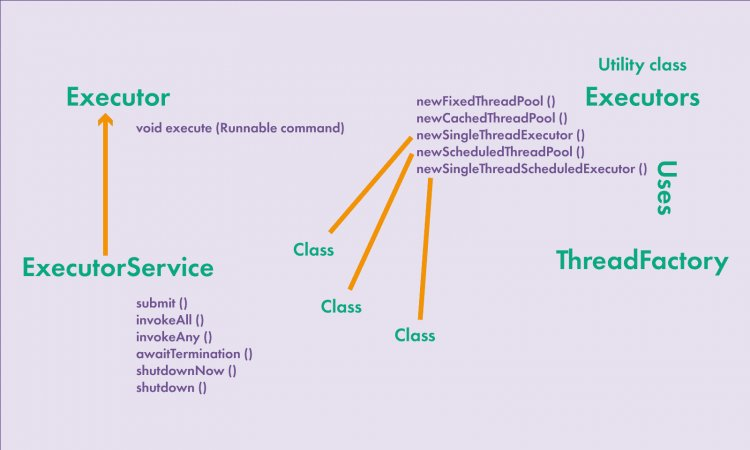

# Многопоточность в Java

За созданием и управлением пулом потоков в Java отвечает Executor Framework
* https://senior.ua/articles/mnogopotochnost-v-java-lekciya-4-puly-potokov


* `Executor` — этот интерфейс имеет один метод ```void execute(Runnable command)```
               после вызова и передачи задачи на выполнение - эта задача будет выполнена асинхронно
* `ExecutorService` — этот интерфейс наследуется `Executor` для выполнения `Callable`-задач, которые возвращают результат
* `ExecutorService.submit()` — этот метод реализует интерфейс `Future`, который возвращают результат выполнения задач
* `ExecutorService.shutdown()` — этот метод позволяет завершить работу пула потоков (новые задачи они будут отклонены)
* `ExecutorService.shutdownNow()` — этот метод позволяет завершить работу пула потоков (не запускает задачи, которые ранее были уже установлены на выполнение)
* `ExecutorService.awaitTermination(long timeout, TimeUnit unit)` — этот метод блокирует поток, который вызвал этот метод пока не истечет таймаут
* `Executor.isDone()` — этот метод позволяет узнать есть ли результат
* `Executor.get()` — этот метод позволяет получить результат
* `Executor.cancel()` — этот метод позволяет отменить задание

Основные реализации пула потоков (т.е. реализации интерфейсов `Executor` и `ExecutorServcie`): 
1. `ThreadPoolExecutor` — пул потоков который содержит фиксированное количество потоков
2. `Executors.newCachedThreadPool()` — если в пуле не хватает потоков в нем будет создан новый поток
3. `Executors.newSingleThreadExecutor()` — пул потоков в котором есть только один поток
4. `ScheduledThreadPoolExecutor` — этот пул потоков позволяет запускать задания с определенной

Для создания потоков:
* `ThreadFactory` — это интерфейс с одним методом ```Thread newThread(Runnable r)```, выполняет несколько объектов Runnable, называется: Worker
                    используется чтобы настроить поток для пула потоков (установить имя, приоритет потока, установить ExceptionHandler для потока, сделать потоки внутри демонами)

Цепочка выполнения такая: ThreadPoolExecutor -> Thread -> Worker -> YourRunnable.

